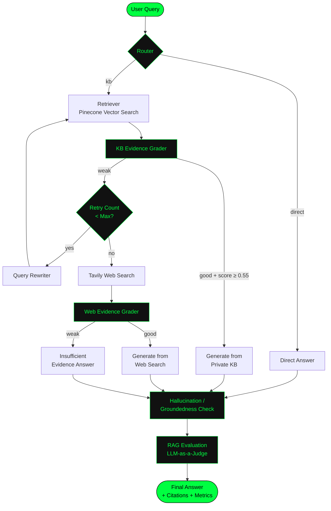
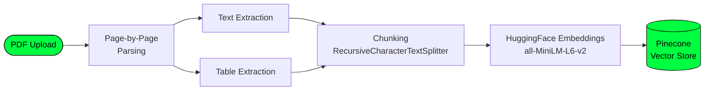

# CortexRAG

### Adaptive Agentic RAG with Self-Correcting Retrieval, Multimodal Understanding & Evaluation


CortexRAG is an **Adaptive Agentic RAG system** that goes beyond basic retrieval-augmented generation. Built using **LangGraph**, it implements an intelligent agentic workflow capable of routing queries, grading retrieved evidence, rewriting weak queries, and falling back to web search when the private knowledge base is insufficient.

The system supports **multimodal PDF processing**, extracting both text and tables while preserving page-level metadata for accurate citations. After generating an answer, it performs **hallucination and groundedness detection**, followed by **RAG evaluation** using LLM-as-a-Judge metrics such as Faithfulness, Answer Relevance, Context Relevance, and Groundedness.

Full **observability** is integrated, allowing users to view the complete agent execution path and detailed node-level traces, all inside a modern dark-themed Streamlit interface.

---

## ✨ Key Features

- 🧭 **Intelligent Routing** — decides between direct chat and knowledge-base retrieval
- 🔁 **Self-Correcting Retrieval** — evidence grading → query rewriting → re-retrieval
- 🌐 **Web Fallback** — automatic Tavily web search when the private KB is insufficient
- 📄 **Multimodal PDF Ingestion** — text + table extraction with page-level metadata
- 🛡️ **Hallucination / Groundedness Detection** — post-generation faithfulness check
- 📊 **RAG Evaluation Metrics** — LLM-as-a-Judge scoring (Faithfulness, Answer Relevance, Context Relevance, Groundedness)
- 🔍 **Full Observability** — complete agent execution path + node-level trace log
- 📌 **Source Citations** — document name, page number, and content type
- 🎨 **Modern Dark UI** — neon-green themed Streamlit interface

---

## 🏗️ Architecture



### Multimodal Ingestion Pipeline



---

## 🛠️ Tech Stack

| Component            | Technology                       |
|-----------------------|-----------------------------------|
| Agent Orchestration   | LangGraph                        |
| LLM                   | Groq (`openai/gpt-oss-20b`)      |
| Embeddings             | HuggingFace (`all-MiniLM-L6-v2`) |
| Vector Database        | Pinecone                         |
| Web Search             | Tavily                           |
| PDF Processing         | PyMuPDF                          |
| UI                     | Streamlit                        |
| Structured Output      | Pydantic + JSON Mode             |

---

## 📦 Installation

```bash
# Clone the repository
git clone https://github.com/your-username/cortex-rag.git
cd cortex-rag

# Create a virtual environment
python -m venv .venv

# Activate it
# Windows
.venv\Scripts\activate
# Linux / Mac
source .venv/bin/activate

# Install dependencies
pip install -r requirements.txt
```

### requirements.txt

```
streamlit
langgraph
langchain
langchain-groq
langchain-huggingface
langchain-pinecone
langchain-tavily
langchain-text-splitters
langchain-community
pinecone
sentence-transformers
pymupdf
pillow
python-dotenv
pydantic
```

---

## ⚙️ Configuration

Create a `.env` file in the project root:

```
GROQ_API_KEY=gsk_your_groq_key
TAVILY_API_KEY=tvly_your_tavily_key
PINECONE_API_KEY=your_pinecone_key
```

Alternatively, keys can be entered directly in the Streamlit sidebar at runtime.

---

## 🚀 Running the Application

```bash
streamlit run cortex_rag_app.py
```

Then open your browser at:

```
https://cortexrag-adaptive-agentic-rag-with-self-correction-evaluation.streamlit.app/
```

---

## 📄 How to Use

1. Upload a PDF from the sidebar (text + tables are automatically parsed).
2. Ask a question about the document or any general topic.
3. The agent will:
   - Route the query (direct chat vs. knowledge base)
   - Retrieve relevant chunks from Pinecone
   - Grade the retrieved evidence
   - Rewrite the query and retry if evidence is weak
   - Fall back to web search if still insufficient
   - Generate a grounded answer with citations
   - Run a hallucination / groundedness check
   - Score the response with RAG evaluation metrics
4. Expand the **Observability & Evaluation** panel to inspect:
   - Full agent execution path
   - Evaluation scores (Faithfulness, Relevance, Groundedness)
   - Source citations
   - Complete node-by-node trace log

---

## 📊 Evaluation Metrics

CortexRAG uses an **LLM-as-a-Judge** approach to score every generated answer:

| Metric              | What It Measures                                      |
|----------------------|--------------------------------------------------------|
| Context Relevance    | Was the retrieved context actually relevant?          |
| Answer Relevance     | Does the answer address the user's question?          |
| Faithfulness         | Is the answer fully supported by the retrieved context? |
| Groundedness         | PASS / FAIL — are claims traceable to evidence?        |
| Hallucination Check  | Are there unsupported claims in the answer?            |

---

## 📁 Project Structure

```
cortex-rag/
├── cortex_rag_app.py       # Main Streamlit application
├── .env                    # API keys (not committed)
├── requirements.txt
├── README.md
└── assets/                 # Screenshots / diagrams (optional)
```

---

## 🧠 Key Design Decisions

- **LangGraph** was chosen for explicit control flow and node-level observability over a single monolithic chain.
- The **self-correction loop** (grade → rewrite → re-retrieve → web fallback) mirrors how a human researcher would react to insufficient evidence.
- **Structured outputs** via Pydantic + JSON mode ensure reliable, parseable routing and evaluation decisions from the LLM.
- **Page-level metadata** (document, page, content type) enables accurate, verifiable citations.
- **Observability is first-class**, not an afterthought — every node logs its decision so the full reasoning path is inspectable.

---

## 📈 Future Improvements

- [ ] Hybrid search (BM25 + Dense retrieval)
- [ ] Cross-encoder re-ranking
- [ ] Vision-based image/chart understanding
- [ ] Persistent multi-session chat history
- [ ] Deployment on Streamlit Cloud / Hugging Face Spaces
- [ ] LangSmith / Phoenix integration for advanced tracing

---

## ✍️ Author

Built as a portfolio project demonstrating modern Agentic RAG design patterns — self-correction, multimodal understanding, and evaluation-driven generation.

## 📜 License

This project is available under the MIT License.
